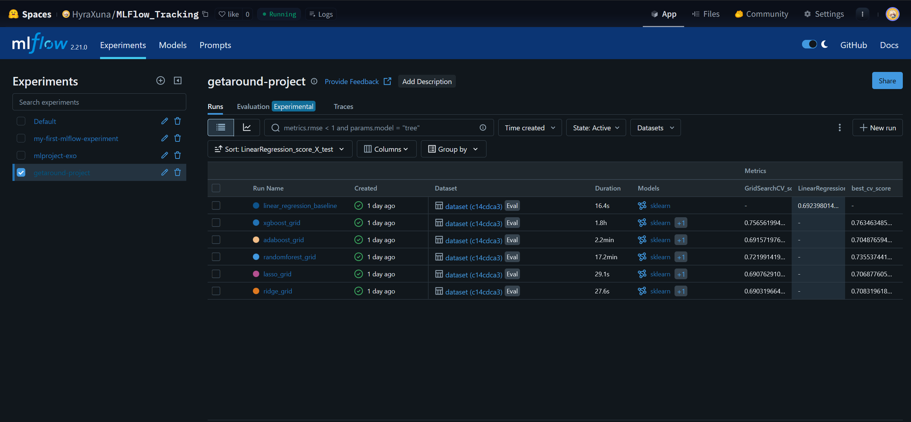
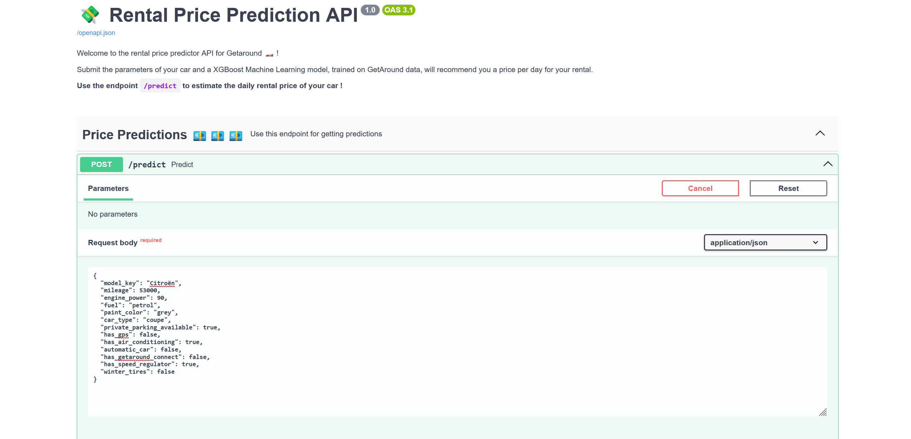
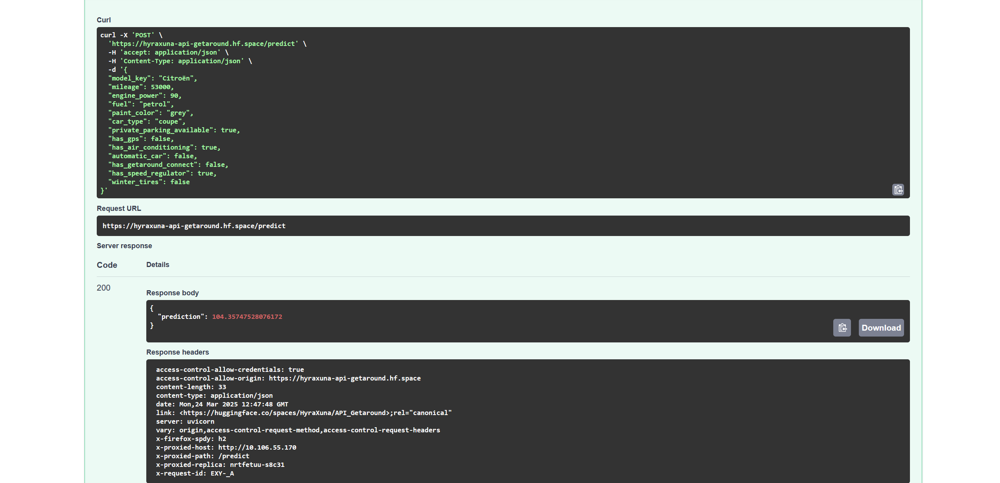

# Getaround project


The goals of this project is to apply deployment abilities:

* Dashboard web app using streamlit, that presents and analyses the data and the problematic. Is there a way, with scope and threshold to deal with late check-out ?
* API that used a saved model to make price prediction of a car rental.

## Getting Started

The first part is the Dasboard web app. For this there is a notebook ([EDA Notebook](Dashboard/Getaround_Project_Jedha_YP_EDA.ipynb)) with all sketch analyses. After that there is the `app.py` file with all the streamlit code used. For the deployment of the app, we used huggingface🤗 free service. 

The second part is the API. First the exploration and sketch model were made on notebook. Models were saved on a MLFlow tracking server and it was usted to loaded the best model in the API to have the price prediction.

### Prerequisites

What things you need to run the codes:

```
python 3.11.5

fastapi[standard]
pydantic 
typing 
pandas 
openpyxl 
mlflow 
boto3 
scikit-learn
python-multipart
fsspec
s3fs
streamlit
matplotlib
seaborn
plotly
xgboost
gunicorn
pickle
```

## Running Tests

The link of the complete deployed Dashbord : https://huggingface.co/spaces/HyraXuna/Getaround_Project_YP 

Here are the saved models:




The best model, with the best test score was the XGBoost with GridSearch. So we used it for the API.

Here the example of what looks like the API:



And the result of the example prediction:



That's working well 💶💶‼️‼️

And There is a page in the dashboard that called the API and that does prediction in function of the car's characterisctics that the user chooses.

## Acknowledgments

* Thanks for Jedha and its instructors for the lectures, exercises and all the work.

